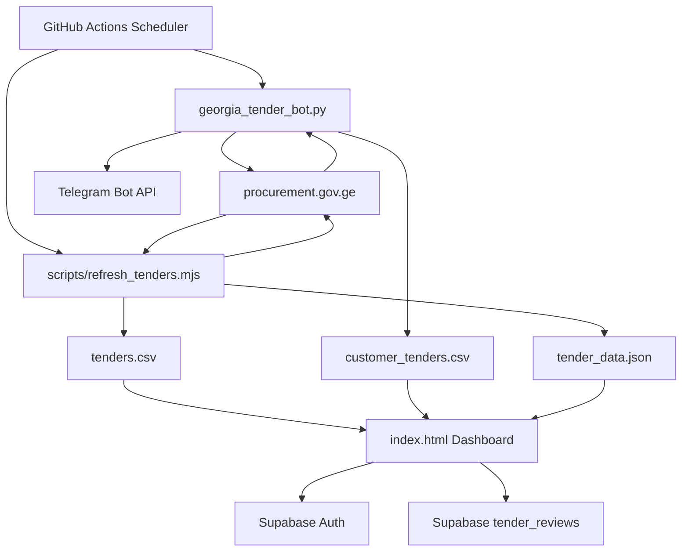
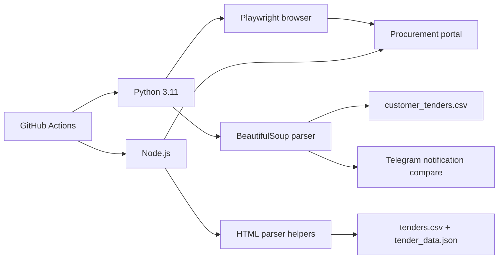
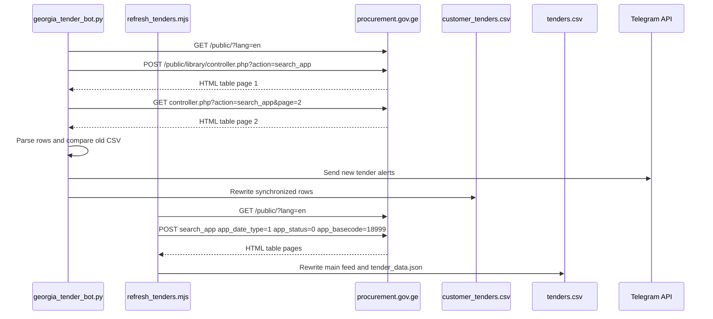
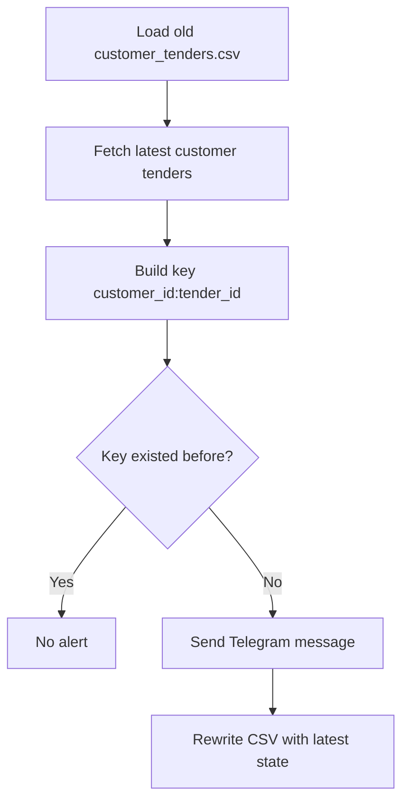

# System Architecture

This document describes the current repository architecture and the target architecture for future AI-assisted development.

> AI assistant note: the current repo does not include a Flask server. Backend behavior is implemented by `georgia_tender_bot.py` and GitHub Actions. Flask is documented as a planned backend boundary.

## High-Level Diagram



## Frontend Architecture

The frontend is a single-file static application in `index.html`.

| Area | Implementation |
| --- | --- |
| Authentication | Supabase Auth session check. |
| Data loading | Browser `fetch()` calls for CSV/JSON files. |
| Tender rendering | Card grid with status/review badges. |
| Detail view | Shared right-side drawer. |
| Customer modal | Full-screen modal with profile and historical tenders. |
| State updates | Supabase table updates for review status and notes. |

### Important Frontend Functions

| Function | Purpose |
| --- | --- |
| `loadData()` | Loads Supabase review data and tender CSV data. |
| `render()` | Renders main tender cards. |
| `openDrawer(tenderId)` | Opens main tender detail drawer. |
| `loadCustomerTendersCSV()` | Loads `customer_tenders.csv`. |
| `openCustomer(customerId)` | Opens customer modal. |
| `renderCustomerTenders(result, c)` | Renders supplier tender rows. |
| `openCustomerTenderDrawer(customerId, tenderId)` | Opens detail drawer for customer tender. |
| `officialTenderLink(t)` | Normalizes official procurement links. |

## Backend Architecture

Current backend behavior is automation-oriented:



### Current Backend Files

| File | Responsibility |
| --- | --- |
| `georgia_tender_bot.py` | Scrapes supplier tender data and sends Telegram notifications. |
| `scripts/refresh_tenders.mjs` | Refreshes the main `Все тендеры` dashboard feed from announcement date `01.03.2026` onward. |
| `scripts/refresh_customer_tenders.mjs` | Local Windows-friendly helper for refreshing monitored supplier CSV data without Python. |
| `requirements.txt` | Python dependencies. |
| `.github/workflows/georgia-tender-bot.yml` | Scheduled automation. |

### Planned Flask Boundary

If Flask is added later, recommended responsibilities:

- Serve dashboard HTML and static assets.
- Provide `/api/tenders` and `/api/customer-tenders` endpoints.
- Proxy/normalize procurement portal data.
- Manage Supabase writes server-side if browser credentials should be reduced.
- Expose health checks and manual refresh endpoints.

## Database Structure

The current persistent review database is Supabase.

### Known Table: `tender_reviews`

| Column | Expected Type | Purpose |
| --- | --- | --- |
| `tender_id` | text | Unique tender identifier. |
| `review_status` | text | `new`, `review`, `relevant`, or `ignored`. |
| `note` | text | Operator note from detail drawer. |

### File-Based Data Tables

#### `tenders.csv`

Main tender data consumed by the dashboard.

Common columns:

```text
date_found,last_seen,id,reg_id,published,name,org,price,deadline,status,cpvs,label,attachment_count,pdf_count,excel_count,image_count,link
```

Generation rules:

- Generated by `scripts/refresh_tenders.mjs`.
- Uses procurement `app_date_type=1`, announcement date.
- Defaults to `MAIN_TENDER_DATE_FROM=01.03.2026`.
- Uses `app_status=0`, so all procurement statuses are included.
- Defaults to portal base category `18999`, equivalent to CPV `45100000`.

#### `customer_tenders.csv`

Supplier-specific tender history.

```text
customer_id,customer_name,tender_id,title,organizer,budget,currency,status,publish_date,deadline,url
```

## API Flow

### Procurement Search Flow



## Tender Parsing Logic

Tender parsing is HTML-based:

1. Select rows using `tr[id^='A']`.
2. Extract `app_id` from row ID, e.g. `A680266` -> `680266`.
3. Extract public tender ID using `NAT\d+`.
4. Extract budget with `GEL` amount regex.
5. Extract published date, deadline, and organizer from row text.
6. Build official URL:

```text
https://tenders.procurement.gov.ge/public/?lang=ru&go={app_id}
```

## Monitored Supplier Integration

Monitored suppliers are configured in `CUSTOMERS`:

```python
"424611441": ("Lago", "12891", "lago"),
"436034916": ("Our Group chveni jgupi", "36827", "our group"),
"405142634": ("Ander Konstrakshen", "104814", "ander konstrakshen"),
"425057341": ("Eplaini", "71057", "eplaini"),
```

| Value | Meaning |
| --- | --- |
| First field | Customer/supplier ID used by dashboard. |
| Second field | Display name. |
| Third field | Procurement portal `app_monac_id`. |
| Fourth field | Supplier search text. |

Current behavior:

- Searches the current year by default.
- Uses `CUSTOMER_TENDER_YEAR` if set.
- Uses procurement `app_date_type=2` by default, so the year is based on offer reception/auction date rather than only announcement date.
- Follows procurement result pagination.
- Writes all monitored supplier rows to `customer_tenders.csv`.
- Sends Telegram alerts for newly detected `customer_id:tender_id` keys.

## Telegram Notification System



Notification dependencies:

- `TELEGRAM_TOKEN`
- `TELEGRAM_CHAT_ID`

## Pagination System

The procurement search endpoint returns HTML with pager metadata:

```text
Record(s) (page: 1/2)
```

The automation extracts the page count and requests subsequent pages using the same search parameters plus `page={page}`. The Python path uses Playwright browser context; the Node helper posts directly with the established session cookie.

```text
/public/library/controller.php?action=search_app&page={page}
```

AI assistant note: do not remove pagination handling. Without it, Lago and the main tender feed only show the first portal page.

## Data Synchronization Logic

| Step | Description |
| --- | --- |
| 1 | Read existing CSV rows before refresh. |
| 2 | Fetch latest portal data. |
| 3 | Deduplicate rows by `customer_id:tender_id`. |
| 4 | Notify Telegram for rows absent from the previous CSV. |
| 5 | Rewrite CSV. |
| 6 | GitHub Actions commits changed CSV files. |

## AI Assistant Operating Notes

- Check `git status` before editing; generated CSV files may change after bot runs.
- Prefer preserving current data contracts because the frontend parses CSV by header name.
- Keep official URL normalization in both frontend and scraper.
- When adding Flask, document every new route in `API_REFERENCE.md`.
